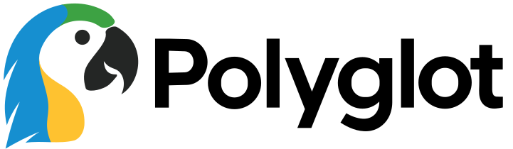

<p align="center"></p>

Polyglot
================================================================================
"Hello World" a popular first program to write when learning a new language.
Polyglot strives to get a working Hello World implementation in as many
languages as possible.

Each implementation is accompanied by a method of executing that code.


Languages
================================================================================
| Language                  | Container                     | Site                                            |
|---------------------------|-------------------------------|-------------------------------------------------|
| Bourne Again Shell (Bash) | ubuntu                        | https://gnu.org/software/bash                   |
| Bourne Shell (Sh)         | alpine                        | -                                               |
| C                         | gcc                           | https://c-language.org                          |
| C#                        | mcr.microsoft.com/dotnet/sdk  | https://learn.microsoft.com/en-us/dotnet/csharp |
| C++                       | gcc                           | https://isocpp.org                              |
| Go                        | golang                        | https://go.dev                                  |
| Haskell                   | haskell                       | https://haskell.org                             |
| Haxe                      | haxe                          | https://haxe.org                                |
| Java                      | openjdk                       | https://java.com                                |
| Javascript                | node                          | -                                               |
| Julia                     | julia                         | https://julialang.org                           |
| Lua                       | ghcr.io/asherglick/lua-alpine | https://lua.org                                 |
| Perl                      | perl                          | https://perl.org                                |
| PHP                       | php                           | https://php.net                                 |
| Python3                   | python                        | https://python.org                              |
| rust                      | rust                          | https://rust-lang.org                           |
| Typescript                | node                          | https://typescriptlang.org                      |
| Zig                       | ghcr.io/asherglick/zig-alpine | https://ziglang.org                             |
| Zshell (zsh)              | ghcr.io/asherglick/zsh-alpine | https://zsh.org                                 |


Primary TODO Languages
--------------------------------------------------------------------------------
| Language                  | Container                     | Site                                            |
|---------------------------|-------------------------------|-------------------------------------------------|
| Clojure                   | clojure                       | https://clojure.org                             |
| Dart                      | dart                          | https://dart.dev                                |
| Erlang                    | erlang                        | https://erlang.org                              |
| Groovy                    | groovy                        | https://groovy-lang.org                         |
| Kotlin                    | -                             | https://kotlinlang.org                          |
| Lisp (Commonlisp)         | -                             | https://common-lisp.net                         |
| Nim                       | nimlang/nim                   | https://nim-lang.org                            |
| Prolog                    | swipl                         | -                                               |
| R                         | r-base                        | https://r-project.org                           |
| Ruby                      | ruby                          | https://ruby-lang.org                           |


Docker Images to Create
--------------------------------------------------------------------------------
| Language     | Link                               | Reason for a custom container                                     |
|--------------|------------------------------------|-------------------------------------------------------------------|
| Bash [alpine]| https://www.gnu.org/software/bash/ | Right now we are using the ubuntu container which ships with bash |


Todo Languages
--------------------------------------------------------------------------------
| Language                  | Container                     | Site                                            |
|---------------------------|-------------------------------|-------------------------------------------------|
| ACTION!                   | -                             | - https://en.wikipedia.org/wiki/Action!_(programming_language)
| Ada                       | -                             | https://adaic.org
| ALGOL                     | -                             | - maybe (https://www.algol60.org/1home.htm)
| AngelScript               | -                             | https://angelcode.com/angelscript
| Arduino                   | -                             | https://arduino.cc
| AssemblyScript            | -                             | https://assemblyscript.org
| awk                       | -                             | - https://en.wikipedia.org/wiki/AWK
| BASIC                     | -                             | - https://en.wikipedia.org/wiki/BASIC
| BrainF\*\*k               | -                             | https://brainfuck.org/
| CHIP-8                    | -                             | - https://en.wikipedia.org/wiki/CHIP-8
| Cobol                     | -                             | - https://en.wikipedia.org/wiki/COBOL
| CoffeeScript              | -                             | https://coffeescript.org
| Cold Fusion               | -                             | https://adobe.com/products/coldfusion-family.html
| COMAL                     | -                             | - https://en.wikipedia.org/wiki/COMAL
| CUDA                      | nvidia/cuda                   | https://developer.nvidia.com/cuda-zone
| D                         | -                             | https://dlang.org
| Elixer                    | -                             | https://elixir-lang.org
| Elm                       | -                             | https://elm-lang.org
| F#                        | mcr.microsoft.com/dotnet/sdk  | https://fsharp.org
| Forth                     | -                             | https://forth-standard.org
| Fortran                   | -                             | https://fortran-lang.org
| Game Maker Language       | -                             | https://gamemaker.io
| GDScript                  | -                             | https://godotengine.org
| Gleam                     | -                             | https://gleam.run
| GLSL                      | -                             | - https://en.wikipedia.org/wiki/OpenGL_Shading_Language
| Google Apps Script        | -                             | https://developers.google.com/apps-script
| HLA (High Level Assembly) | -                             | https://plantation-productions.com/Webster/HighLevelAsm/index.html
| HLSL (High Level Shader Language) | -                     | https://learn.microsoft.com/en-us/windows/win32/direct3dhlsl/dx-graphics-hlsl
| J                         | -                             | https://jsoftware.com
| JOSS                      | -                             | - https://en.wikipedia.org/wiki/JOSS
| Jq                        | ghcr.io/jqlang/jq             | http://jqlang.org
| LabView                   | -                             | https://ni.com/labview
| Matlab                    | mathworks/matlab              | https://mathworks.com/products/matlab.html
| MUMPS                     | -                             | - https://en.wikipedia.org/wiki/MUMPS
| Objective-C               | -                             | https://developer.apple.com/library/archive/documentation/Cocoa/Conceptual/ProgrammingWithObjectiveC/Introduction/Introduction.html
| Ocaml                     | ocaml/opam                    | https://ocaml.org
| Octave                    | gnuoctave/octave              | https://octave.org
| OpenCL                    | -                             | https://khronos.org/opencl
| Pascal                    | -                             | - https://en.wikipedia.org/wiki/Pascal_(programming_language)
| PL/SQL                    | -                             | https://www.oracle.com/database/technologies/appdev/plsql.html
| PowerShell                | mcr.microsoft.com/dotnet/sdk  | https://learn.microsoft.com/en-us/powershell/ (docker run -it mcr.microsoft.com/dotnet/sdk:9.0 pwsh)
| QtScript                  | -                             | -https://en.wikipedia.org/wiki/QtScript
| Racket                    | -                             | https://racket-lang.org
| Scala                     | -                             | https://scala-lang.org
| Scheme                    | -                             | https://scheme.org
| Smalltalk                 | -                             | - https://en.wikipedia.org/wiki/Smalltalk
| Swift                     | swift                         | https://www.swift.org
| TCL                       | -                             | https://tcl-lang.org
| Verilog                   | -                             | - https://en.wikipedia.org/wiki/Verilog
| Vim Script                | -                             | - https://en.wikipedia.org/wiki/Vim_(text_editor)#Vim_script
| Visual Basic              | -                             | https://docs.microsoft.com/dotnet/visual-basic
| WebAssembly               | -                             | https://webassembly.org
| Whitespace                | -                             | - https://en.wikipedia.org/wiki/Whitespace_(programming_language)
| x86 Assembly              | -                             | - https://en.wikipedia.org/wiki/X86_assembly_language


Languages where terminal is non-default
--------------------------------------------------------------------------------
| Lanuguage      | Description                    | Site
|----------------|--------------------------------|----------------------------|
| ActionScript 2 | Adobe Flash Coding Language    |
| ActionScript 3 | Adobe Flash Coding Language    |
| JASS           | Blizzard/Warcraft3 Script      |
| Visual BASIC   | Microsoft's BASIC GUI language |
| Delphi         | Windows only gui language      | https://www.embarcadero.com/products/delphi
| Logo           | Line drawing tool              | https://en.wikipedia.org/wiki/Logo_(programming_language)
| Pico8          | Fantasy Console (uses Lua)     | https://lexaloffle.com/pico-8.php
| OpenSCAD       | Programataic 3D CFG CAD Lang   | https://openscad.org, https://hub.docker.com/r/openscad/openscad


Non Programming Languages
--------------------------------------------------------------------------------
| Lanuguage      | Description                  | Site
|----------------|------------------------------|----------------------------|
| PostScript     | Data Language                | -https://en.wikipedia.org/wiki/PostScript
| Sed            | Not Turing Complete?         | -https://en.wikipedia.org/wiki/Sed
| JSON           | Data Language                |
| YAML           | Data Language                |
| XML            | Data Language                |
| HTML           | Data Language                |
| SQL            | Query Language               |
| VHDL           | logic desciption language    | - https://en.wikipedia.org/wiki/VHDL


FAQ
================================================================================
**Why do this?**  
This may seem like a silly fun project, but under the thin veneer of comedy you
will find that this repo serves as a boilerplate for executing source code
across a large number of languages. Anyone who wants to test an algorithm in
multiple languages now has a simple springboard to launch off of in order to
execute code in those languages.

This is useful for many purposes. For example, learning how different languages
parse floating point numbers from their decimal ASCII input to their IEEE 754
binary format.


Future
================================================================================

Templated Runtimes
--------------------------------------------------------------------------------
Many more testing options open up with templated runtimes, allowing for
multiple versions of a language or build system to be tested within a single
matrix configuration test without having to rewrite the language's code, or
copy the code, for each version pair. This will necessitate having a
configuration file of some sort.


Internationalization
--------------------------------------------------------------------------------
This entire project is about supporting multiple languages. If that is the case
then it should also make sense that we should support multiple human languages
too and not just English. This will be easier once the templated runtimes
are achieved.


All Custom Docker Containers
--------------------------------------------------------------------------------
If the docker containers used become completely custom built, then we can also
force documentation for how the compile tools and or runtimes must be installed
via the docker configuration files. If this is done though we likely do not
want to remove support for the official containers and instead that might be
another dimension to query.


Possible Other Programs
--------------------------------------------------------------------------------
* Hello World
* FizzBuzz
* Factorial Calculator
* String Reversal
* Prime Number Checker
* Fibonacci Sequence
* Palindrome Checker
* Number Guessing Game (requires stdin and could be hard to test)
* Echo (requires stdin)
* Even or Odd
* Word Counter
* UTF-8 Box Drawing
* JSON Parsing / Writing


Language Version + Tooling Combinations
--------------------------------------------------------------------------------
Adding tooling to support different build environments and runtimes is one of
our goals. This is the curent plan.

Some custom docker image tags will be changed to include the tooling they use:
`<language>:<tooling>-<baseimage>`
`python:cpython3.6.1-alpine3.21.3`

We don't need to include the language version numbers in the docker images
because we are not installing language versions, but tooling versions, to the
docker images. However in many cases the tooling version will be identical to
the language version.

The folder structure will be changed to include variants for both version and tooling
`<language>/<version>/tooling`
```
├── python/
│   ├── config.json
│   ├── 3.6.1/
│   │   └── cpython3.6.1/
│   │       └── run.sh
│   └── 3.12.0/
│       └── cpython3.12.0/
│           └── run.sh
└── cpp/
    ├── config.json
    ├── cpp98/
    │   ├── clang20/
    │   │   └── run.sh
    │   ├── clang19/
    │   │   └── run.sh
    │   └── clang18/
    │       └── run.sh
    └── cpp03/
        ├── clang20/
        │   └── run.sh
        ├── clang19/
        │   └── run.sh
        └── clang18/
            └── run.sh
```

Not all tooling is applicable to all versions of the language. In order to keep
track of this and prevent the creation of impossible language version / tooling
combinations each language will have a `config.json` that contains information
about the versions and tooling for that language. This data can also be used to
identify which combinations are missing, as well as create web docs for
navigating the repo.
```json
"tooling": {
	"<tool_name>": {
		"<version_number>": ["<supported_language_version>", "<supported_language_version>"]
	}
}
```

```json
"tooling": {
	"cpython": {
		"3.10": ["3.10"],
		"3.9": ["3.9"]
	}
}
```

```json
"build_systems" [
	{
		"name": "cmake3.5",
		"compilers": ["clang20"],
		"files": "cmakelists3.5"
	},
	{
		"name": null, // No build system
		"compilers": ["*"], // Do we want to allow wildcards? Could be helpful in versioning "1.2.*" sort of things
		"files": null
	}
],
"compilers": [
	{
		"name": "clang20",
		"language_versions": ["cpp23", "cpp20", "cpp17", "cpp14", "cpp11", "cpp98"],
		"files": null
	}, {
		"name": "clang4",
		"language_versions": ["cpp14", "cpp11", "cpp98"],
		"files": null
	}, {
		"name": "clang3.3",
		"language_versions": ["cpp11", "cpp98"],
		"files": null
	}
],
"language_versions": [
	{ "name": "cpp98", "source": "src1" },
	{ "name": "cpp11", "source": "src1" },
	{ "name": "cpp14", "source": "src1" },
	{ "name": "cpp17", "source": "src2" }, // Code changed between versions
	{ "name": "cpp20", "source": "src2" },
	{ "name": "cpp23", "source": "src2" }
]

```
